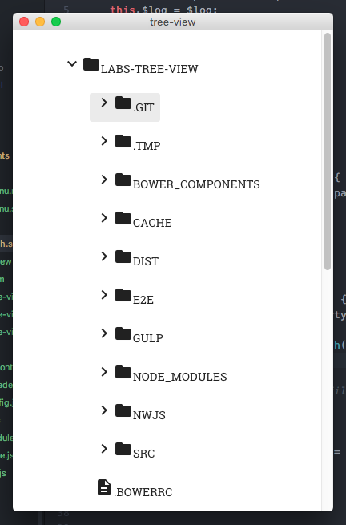
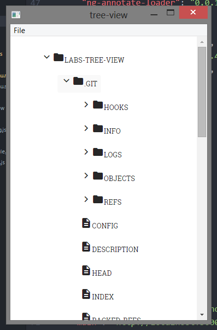

# Tree View Example

An example of a fs tree view built with [Angular.js](https://github.com/angular/angular.js) and [Nw.js](https://github.com/nwjs/nw.js)






### Install dependencies

```
$ echo 'grab a ☕' && npm i && bower install
```

### Start desktop application
```
$ gulp nwjs:serve
```
